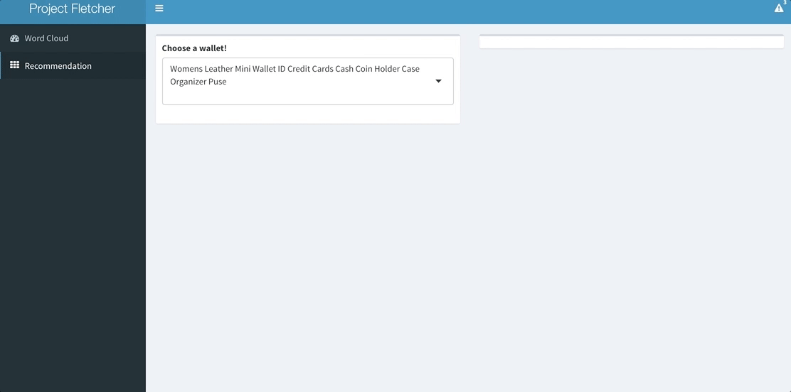

# Wallet Recommender

Project will be up shortly...
In the meantime check out my gif updates on my Wallet Recommender Dashboard

A Word Cloud Manipulator

Wallet Recommendation System

## Built With

##### Languages
* Python
* R

##### Data Manipulation & Machine Learning Tools
* Pandas
* Kmeans
* Sklearn
* RecommenderLab
* NLTK

##### Framework and Visualization Tools
* Shiny
* WordCloud

##### Data
* R. He, J. McAuley. Modeling the visual evolution of fashion trends with one-class collaborative filtering. WWW, 2016
* J. McAuley, C. Targett, J. Shi, A. van den Hengel. Image-based recommendations on styles and substitutes. SIGIR, 2015

## Author & More Info

* **Michael Carrie** - [Blog](https://mcarrie30.github.io/)

